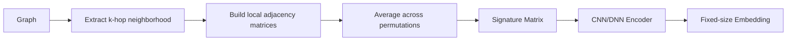

# The LSME Algorithm

LSME (Local Structural Matrix Embeddings) captures local structural patterns around each node in a graph and converts them into fixed-size vector representations.

## Overview

The algorithm works in three main steps:

1. **Extract local neighborhood** for each node
2. **Build signature matrix** capturing structural patterns
3. **Encode to fixed-size embedding** using a neural network

## Step 1: Extract Local Neighborhood

For each node $v$, we extract its $k$-hop neighborhood using breadth-first search (BFS):

```
Layer 0: {v}           (root node)
Layer 1: neighbors of v
Layer 2: neighbors of layer 1 (excluding layers 0-1)
...
Layer k: nodes at distance k from v
```

The `max_hops` parameter controls how far we look from each node.

## Step 2: Build Signature Matrix

### The Stochastic Approach

For the stochastic method, we build the signature matrix through permutation averaging:

1. **Order nodes by layer**: Place root at position 0, then layer 1 nodes, layer 2 nodes, etc.

2. **Random permutation**: Within each layer, randomly shuffle node order

3. **Build adjacency matrix**: Create local adjacency matrix with this ordering

4. **Repeat and average**: Do this $N$ times (controlled by `n_samples`) and average

The resulting **signature matrix** $S_v$ is:

$$S_v = \frac{1}{N} \sum_{i=1}^{N} A_v^{(\pi_i)}$$

where $A_v^{(\pi_i)}$ is the local adjacency matrix under permutation $\pi_i$.

### Why Permutation Averaging?

- **Permutation invariance**: Nodes in the same layer are structurally equivalent, so their order shouldn't matter
- **Probabilistic representation**: The average captures the probability of edges between layer positions
- **Smooth representation**: More samples = smoother, more stable signature

## Step 3: Encode to Fixed-Size Embedding

Signature matrices vary in size (depending on neighborhood size), so we use a neural network autoencoder to compress them:

```
Signature Matrix → CNN/DNN Encoder → Fixed-size Embedding
     (N×N)                              (d,)
```

The encoder is trained to reconstruct the original matrices, learning a compact representation in the bottleneck layer.

## Visualizing the Process



## Key Parameters

| Parameter | Description | Default |
|-----------|-------------|---------|
| `max_hops` | Neighborhood radius | 2 |
| `n_samples` | Permutation samples | 100 |
| `embedding_dim` | Output embedding size | 32 |
| `encoder_type` | 'cnn' or 'dnn' | 'cnn' |

## Intuition

Consider two nodes in a graph:

- **Hub node**: Connected to many nodes in layer 1, forms a "star" pattern
- **Bridge node**: Connected to few nodes, linear chain structure

Their signature matrices will look very different:

- Hub: Dense first row/column (many layer 1 connections)
- Bridge: Sparse, with edges along diagonals

The LSME embedding captures these structural differences, allowing downstream ML models to distinguish between structural roles.
