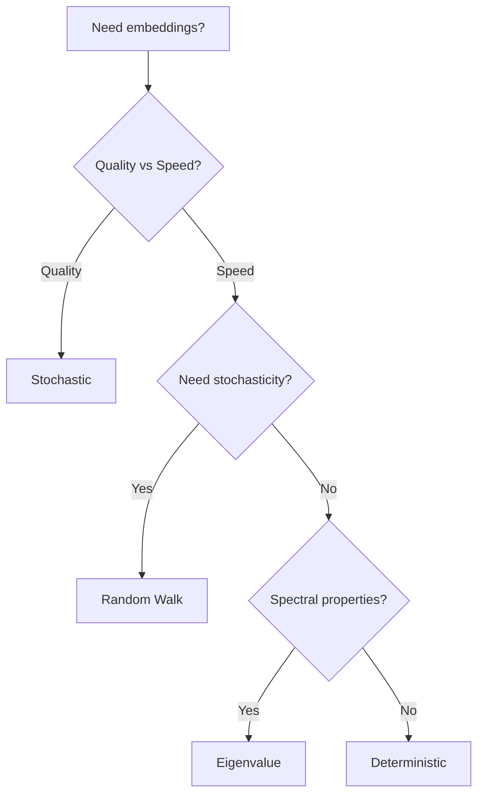

# Embedding Methods

LSME supports four different methods for computing node embeddings. Each has different trade-offs in terms of computation, interpretability, and embedding quality.

## Method Comparison

| Method | Output Dim | Speed | Interpretability | Best For |
|--------|-----------|-------|------------------|----------|
| Stochastic | `embedding_dim` | Slow | High (matrices) | Best quality |
| Deterministic | `3*(max_hops+1)` | Fast | Medium | Quick analysis |
| Random Walk | `3*(max_hops+1)` | Medium | Medium | Stochastic patterns |
| Eigenvalue | `max_hops+1` | Fast | Low | Spectral properties |

## Stochastic Method

The default and most powerful method. Creates signature matrices through permutation averaging, then encodes them with a neural network.

```python
lsme = LSME(
    method='stochastic',
    max_hops=2,
    n_samples=100,        # More samples = smoother signatures
    embedding_dim=32,     # Output dimension
    encoder_type='cnn',   # 'cnn' or 'dnn'
    encoder_epochs=100    # Training epochs
)
result = lsme.fit_transform(G)
```

**Pros:**

- Highest quality embeddings
- Captures complex structural patterns
- Interpretable intermediate representation (signature matrices)

**Cons:**

- Slowest (requires encoder training)
- More memory for large graphs

## Deterministic Method

Computes transition probabilities between layers based on edge counts. No randomness, no encoder needed.

```python
lsme = LSME(
    method='deterministic',
    max_hops=3
)
result = lsme.fit_transform(G)

# Output dimension: 3 * (max_hops + 1) = 12
```

For each layer, computes three probabilities:

- **pp**: Probability of edge to previous layer
- **pc**: Probability of edge within current layer
- **pn**: Probability of edge to next layer

**Pros:**

- Very fast
- Deterministic (reproducible)
- No training required

**Cons:**

- Lower dimensional
- Less expressive

## Random Walk Method

Uses random walks to estimate transition probabilities. Stochastic but doesn't require encoder training.

```python
lsme = LSME(
    method='random_walk',
    max_hops=2,
    rw_length=10,      # Steps per walk
    sample_size=100    # Number of walks
)
result = lsme.fit_transform(G)
```

**Pros:**

- Captures stochastic patterns
- Faster than stochastic method
- No encoder needed

**Cons:**

- Lower dimensional than stochastic
- Some variance between runs

## Eigenvalue Method

Extracts eigenvalues from layer transition matrices. A spectral approach.

```python
lsme = LSME(
    method='eigenvalue',
    max_hops=3
)
result = lsme.fit_transform(G)

# Output dimension: max_hops + 1 = 4
```

**Pros:**

- Very fast
- Captures spectral properties
- Mathematically grounded

**Cons:**

- Very low dimensional
- Less intuitive interpretation

## Choosing a Method



### Use Stochastic When:

- Quality is paramount
- You want interpretable signature matrices
- You have GPU for encoder training
- Graph is not too large

### Use Deterministic When:

- Speed matters more than quality
- You need reproducible results
- Quick exploratory analysis

### Use Random Walk When:

- You want stochastic patterns without encoder overhead
- Moderate speed/quality trade-off

### Use Eigenvalue When:

- Spectral properties are relevant
- Very fast computation needed
- Very low-dimensional embedding acceptable

## Unified Output Format

All methods return the same structure:

```python
result = lsme.fit_transform(G)

# Always present
result['embeddings']   # Dict: node -> 1D array
result['method']       # String: method name
result['params']       # Dict: parameters used
result['metadata']     # Dict: method-specific info
```
